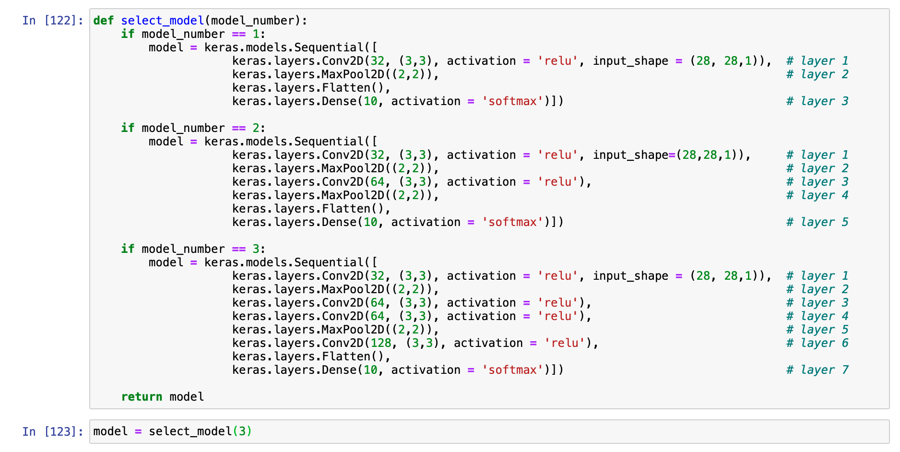

# RESULT

# options

## MODEL 1 :             3 Layers with        1 Convolution layer

## MODEL 2 :             5 Layers with       2 Convolution layer

## MODEL 3 :             7 Layers with       4 Convolution layer

# test the Step

## 1. Perform Test with Test data

## MODEL 1 :             3 Layers with        1 Convolution layer

## MODEL 2 :             5 Layers with       2 Convolution layer

## MODEL 3 :             7 Layers with       4 Convolution layer

## 2. Wrong predictions

### Plot images and probability that model predicted wrong &

### **Find index of wrong prediction &**

### **Plot first 10 wrong predicted images and probability**

## MODEL 1 :             3 Layers with        1 Convolution layer

## MODEL 2 :     5 Layers with 2 Convolution layer

## MODEL 3 :         7 Layers with 4 Convolution layer

As the layer increases with higher convolution layer the accuracy  got higher.
